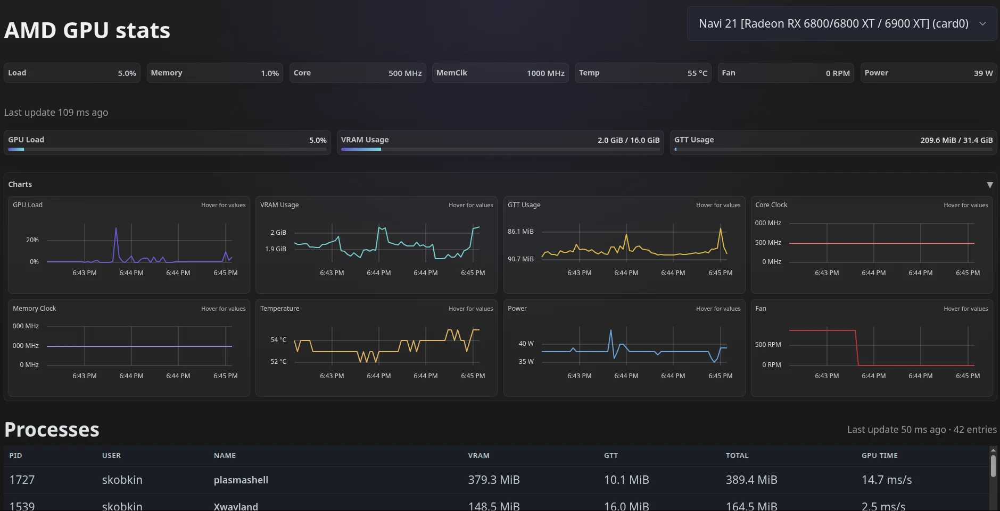

# amdgpu_top-web

[](https://github.com/skobkin/amdgputop-web/actions/workflows/ci.yml)

Read-only web UI for live AMD GPU telemetry inspired by the `amdgpu_top` CLI.
The backend is pure Go (stdlib HTTP + WebSockets) and the frontend is a compact
Preact single-page app.



## Features

- Enumerates DRM GPUs and streams utilization, clocks, temps, VRAM/GTT usage.
- Optional “process top” view sourced from `/proc/*/fdinfo` with engine-time
  deltas when exposed by the kernel.
- REST endpoints for `/api/gpus`, `/api/gpus/<id>/metrics`, and `/api/gpus/<id>/procs`
  alongside a WebSocket feed (`/ws`).
- Configuration via environment variables (`APP_*`), including sampler cadence,
  process scanner limits, and allowed origins.

## Quick Start (host build)

```bash
go build ./cmd/amdgputop-web
./amdgputop-web            # listens on :8080 by default
```

On AMD hardware you can sanity-check the sampler without the web UI:

```bash
go run ./cmd/sampler-test -sample
```

## Docker

An Alpine-based multi-stage image is defined in `Dockerfile`.

```bash
docker build -t amdgputop-web:dev .

VID_GID=$(getent group video | cut -d: -f3)
RENDER_GID=$(getent group render | cut -d: -f3)

docker run --rm -p 8080:8080 \
  --device=/dev/dri \
  --device=/dev/kfd \
  --group-add "${VID_GID}" \
  --group-add "${RENDER_GID}" \
  --pid=host \
  --cap-add SYS_PTRACE \
  --user root \
  amdgputop-web:dev
```

> **Why root + `SYS_PTRACE`?** Reading `/proc/<pid>/fdinfo` for host workloads
> requires elevated privileges and the `CAP_SYS_PTRACE` capability. Running the
> container as `root` with `--cap-add SYS_PTRACE` is the simplest way to let the
> process scanner observe GPU clients outside the container. If you only need
> device-level metrics, you can omit `--pid=host`, `--user root`, and the extra
> capability and run with the default non-root user.

Refer to `docs/DOCKER.md` for more detail, including why `--pid=host` is needed
to observe host processes.

### Troubleshooting & permissions

- The [permissions matrix](docs/DOCKER.md#permissions-matrix) explains which
  flags, groups, and capabilities are required for device-only metrics versus
  host process telemetry.
- If the UI shows empty process tables or partial metrics, consult the
  [troubleshooting section](docs/DOCKER.md#troubleshooting) for the most common
  container permission fixes.

## Configuration

| Variable | Default | Description |
| --- | --- | --- |
| `APP_LISTEN_ADDR` | `:8080` | HTTP listen address. |
| `APP_SAMPLE_INTERVAL` | `250ms` | Metrics sampling cadence (100ms – 2s). |
| `APP_ALLOWED_ORIGINS` | `*` | Comma-separated origins allowed for WebSocket/HTTP. |
| `APP_DEFAULT_GPU` | `auto` | GPU pre-selected on connect (`auto` = first detected). |
| `APP_LOG_LEVEL` | `INFO` | Log verbosity (`DEBUG`, `INFO`, `WARN`, `ERROR`). |
| `APP_ENABLE_PROMETHEUS` | `false` | Enable `/metrics` endpoint when `true`. |
| `APP_ENABLE_PPROF` | `false` | Expose Go pprof handlers on `/debug/pprof/*`. |
| `APP_PROC_ENABLE` | `true` | Toggle process scanner feature. |
| `APP_PROC_SCAN_INTERVAL` | `2s` | Interval between process snapshot scans. |
| `APP_WS_MAX_CLIENTS` | `1024` | Maximum concurrent WebSocket clients. |

See `internal/config/config.go` for the full list, including test-only roots
(`APP_SYSFS_ROOT`, `APP_DEBUGFS_ROOT`, `APP_PROC_ROOT`).

## Development

```bash
# Backend
go test ./...

# Frontend
cd web && npm ci && npm run build
```

CI (see `.github/workflows/ci.yml`) enforces `gofmt`, `go vet`, Go tests,
frontend build, and publishes tagged releases with Linux binaries and Docker
images.
